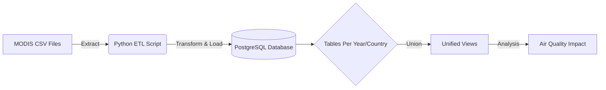

# 🌲 Forest Fires & Air Quality Pipeline


> 🚀 **Pipeline ETL de datos satelitales (MODIS)** para el monitoreo de incendios forestales en Brasil, Colombia y Chile (2010-2020), preparando la data para análisis de impacto ambiental y calidad del aire.

## 📊 Key Features
*   **Ingesta Masiva:** Automatización de carga de datos satelitales (MODIS) históricos.
*   **Gestión Geoespacial:** Procesamiento de coordenadas y brillo (brightness/FRP) para detección de focos de calor.
*   **Arquitectura Escalable:** Diseño en base de datos Relacional (PostgreSQL) con particionado lógico por país y año.

## 🛠️ Project Architecture



## 🧠 Solución Técnica
Este repositorio implementa un pipeline de Ingeniería de Datos que resuelve el problema de la dispersión de datos climáticos:

1.  **Extraction:** Script automatizado (`conexion_carga.py`) que itera sobre datasets anuales.
2.  **Schema Design:** Script SQL (`Tables_setup.sql`) que normaliza la estructura de datos para consistencia espacial y temporal.
3.  **Validation:** Verificación de integridad de datos para evitar duplicados en cargas incrementales.

## 🚀 Getting Started

### Prerequisitos
*   Python 3.8+
*   PostgreSQL 12+
*   Archivo `.env` configurado (ver security best practices).

### Instalación
1.  Clonar el repositorio:
    ```bash
    git clone https://github.com/ManuelCrzUR/Forest-Fires-Air-Quality.git
    ```
2.  Instalar dependencias:
    ```bash
    pip install -r requirements.txt
    ```

### Uso
1.  **Setup de Base de Datos:**
    Ejecutar el script SQL para crear las tablas necesarias.
    ```bash
    psql -U postgres -d forest_fires -f Tables_setup.sql
    ```

2.  **Ejecutar ETL:**
    ```bash
    python refactored_etl.py
    ```

## 📂 Estructura del Proyecto
```text
├── data/               # Datasets crudos (ignorado en git)
├── Tables_setup.sql    # Definición de esquemas DDL
├── conexion_carga.py   # ETL Script original
├── refactored_etl.py   # ETL Script optimizado (New!)
└── README.md
```

## 🤝 Contact
*   **Manuel Cruz** - [GitHub](https://github.com/ManuelCrzUR)
